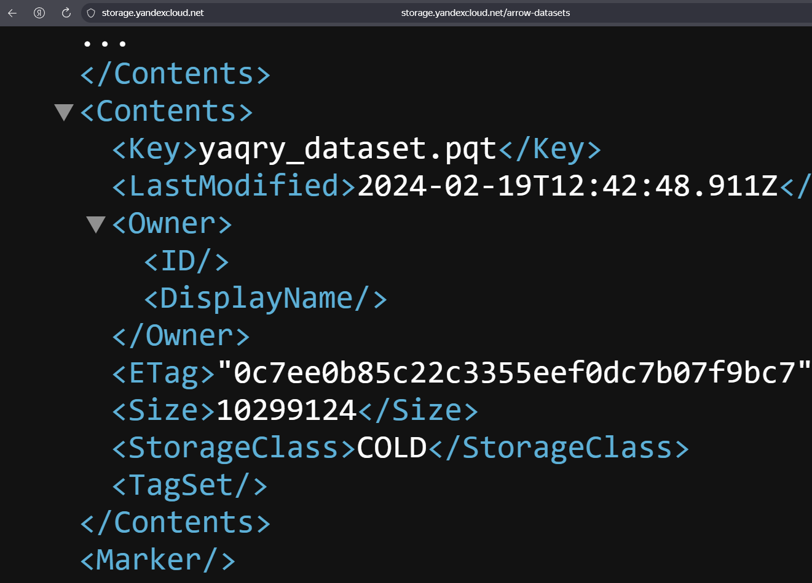
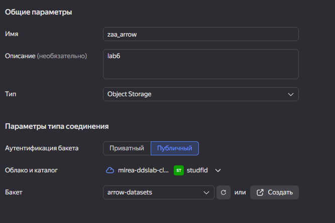
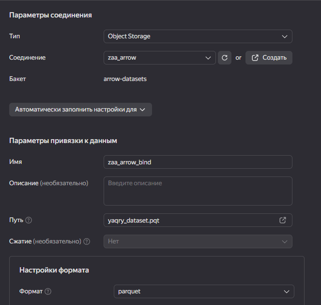
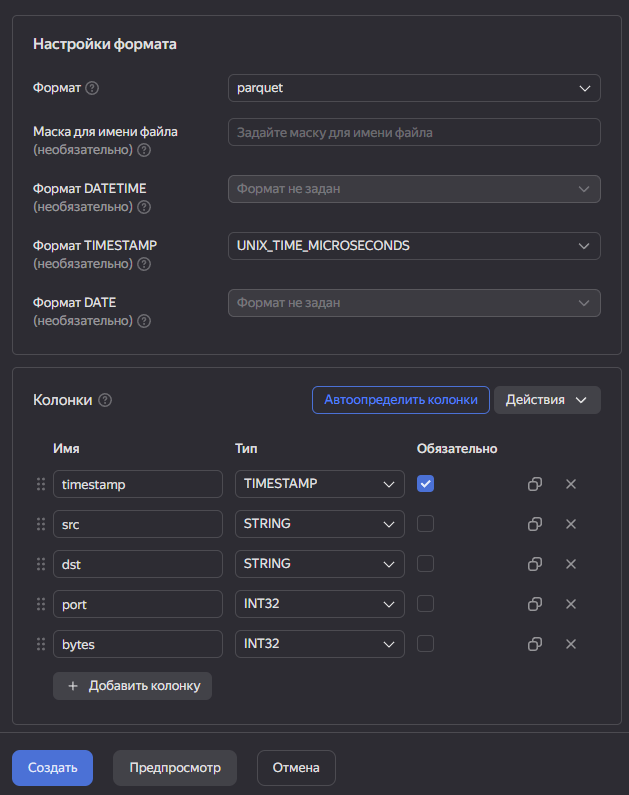
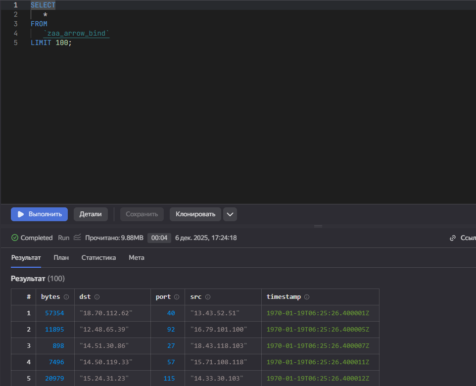
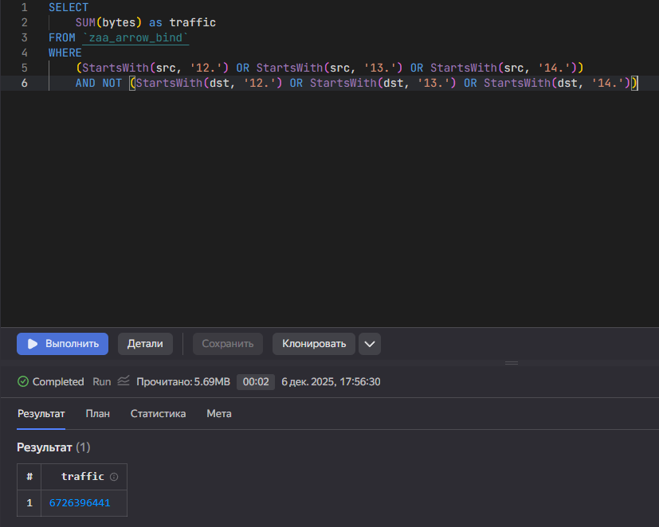
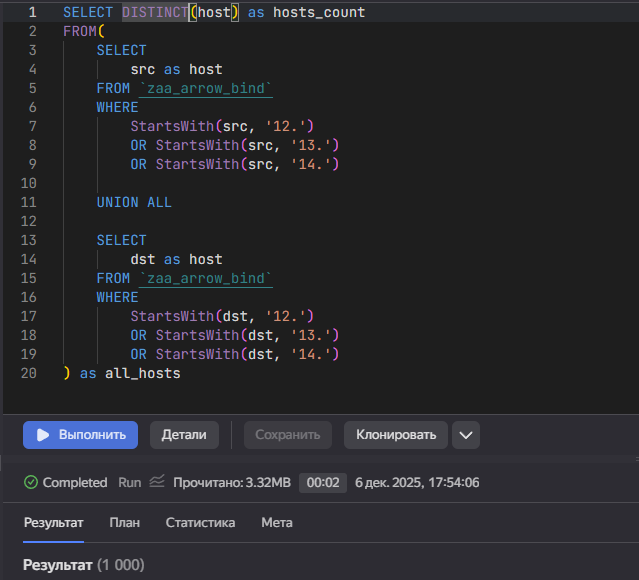
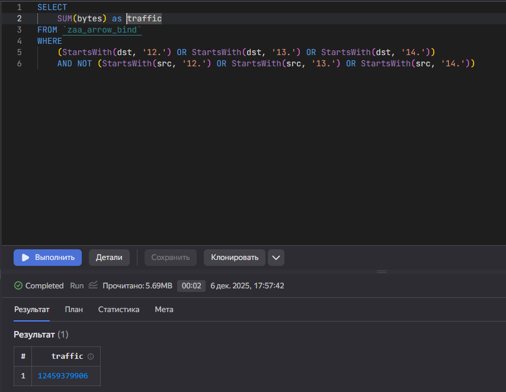

## Цель работы

1. Изучить возможности технологии Yandex Query для анализа структурированных наборов данных
2. Получить навыки построения аналитического пайплайна для анализа данных с помощью сервисов Yandex Cloud
3. Закрепить практические навыки использования SQL для анализа данных сетевой активности в сегментированной корпоративной сети


## Исходные данные

1.  Программное обеспечение Windows 10 Pro
2.  Rstudio Desktop
3.  Интерпретатор языка R 4.5.1
4.  Cервис Yandex DataLens

## Задание

Используя сервис Yandex Query настроить доступ к
данным, хранящимся в сервисе хранения данных
Yandex Object Storage. При помощи соответствующих
SQL запросов ответить на вопросы.

### Шаги

#### Проверка доступности данных в Yandex Object Storage

Для проверки доступности перейдем по ссылке и проверим наличие нужного файла (yaqry_dataset.pqt)



#### Подключить бакет как источник данных для Yandex Query

Создадим соединение для бакета в S3 хранилище



Сделаем привязку данных



Настроим привязки данных и схему



Попробуем отобразить таблицу



#### Анализ

1. Известно, что IP адреса внутренней сети начинаются с октетов, принадлежащих интервалу [12-14]. Определите количество хостов внутренней сети, представленных в датасете.

```{sql}
SELECT DISTINCT(host) as hosts_count
FROM(
    SELECT 
        src as host
    FROM `zaa_arrow_bind`
    WHERE 
        StartsWith(src, '12.') 
        OR StartsWith(src, '13.') 
        OR StartsWith(src, '14.')
    
    UNION ALL
    
    SELECT 
        dst as host
    FROM `zaa_arrow_bind`
    WHERE 
        StartsWith(dst, '12.') 
        OR StartsWith(dst, '13.') 
        OR StartsWith(dst, '14.')
) as all_hosts
```



2. Определите суммарный объем исходящего трафика

```{sql}
SELECT
    SUM(bytes) as traffic
FROM `zaa_arrow_bind`
WHERE 
    (StartsWith(src, '12.') OR StartsWith(src, '13.') OR StartsWith(src, '14.'))
    AND NOT (StartsWith(dst, '12.') OR StartsWith(dst, '13.') OR StartsWith(dst, '14.'))
```



3. Определите суммарный объем входящего трафика

```{sql}
SELECT
    SUM(bytes) as traffic
FROM `zaa_arrow_bind`
WHERE 
    (StartsWith(dst, '12.') OR StartsWith(dst, '13.') OR StartsWith(dst, '14.'))
    AND NOT (StartsWith(src, '12.') OR StartsWith(src, '13.') OR StartsWith(src, '14.'))
```



## Вывод

В ходе работы были изучены возможности технологии Yandex Query для анализа структурированных наборов данных, получены навыки построения аналитического пайплайна для анализа данных с помощью сервисов Yandex Cloud, а также закреплены практические навыки использования SQL для анализа данных сетевой активности в сегментированной корпоративной сети.