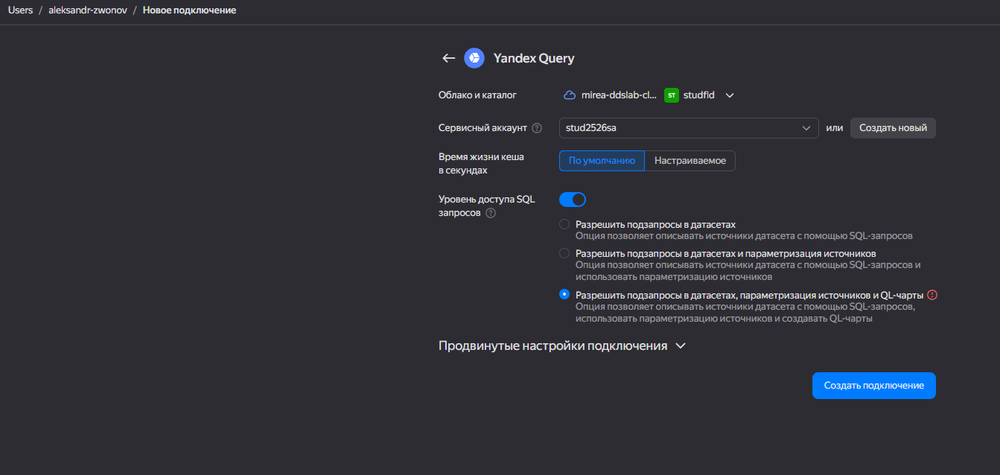
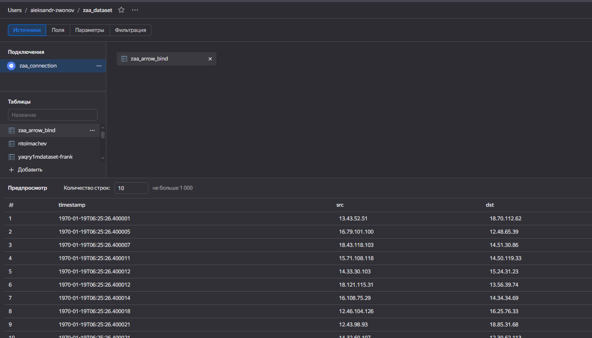
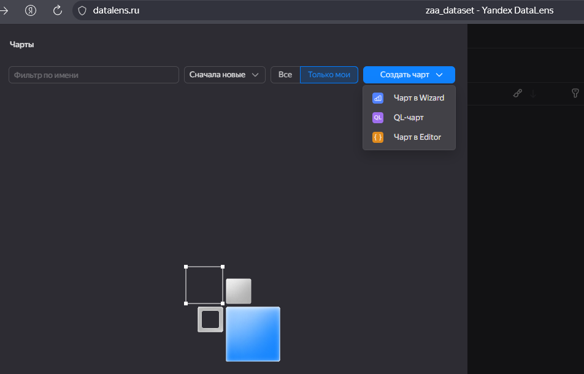
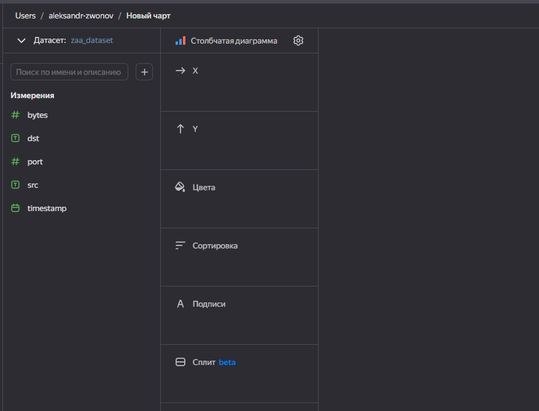
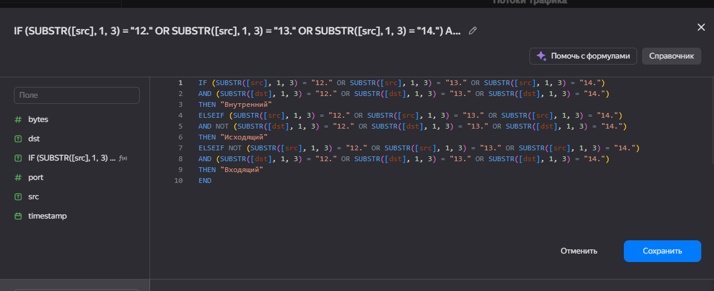
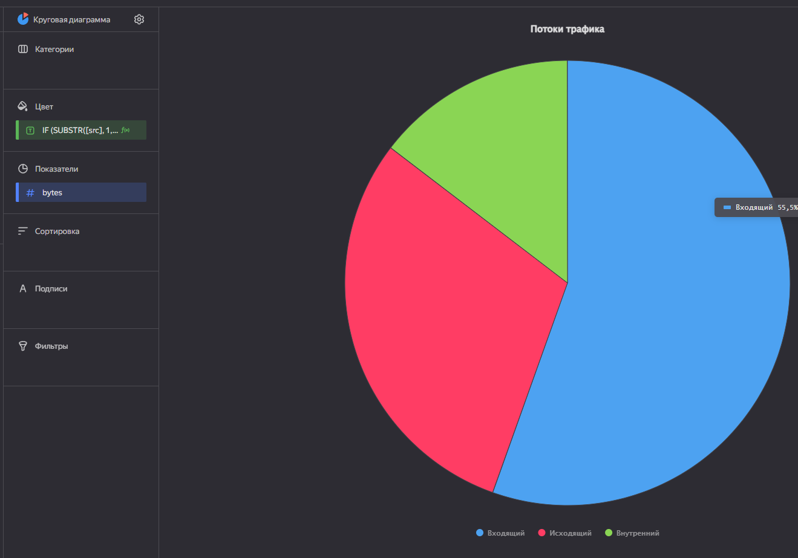
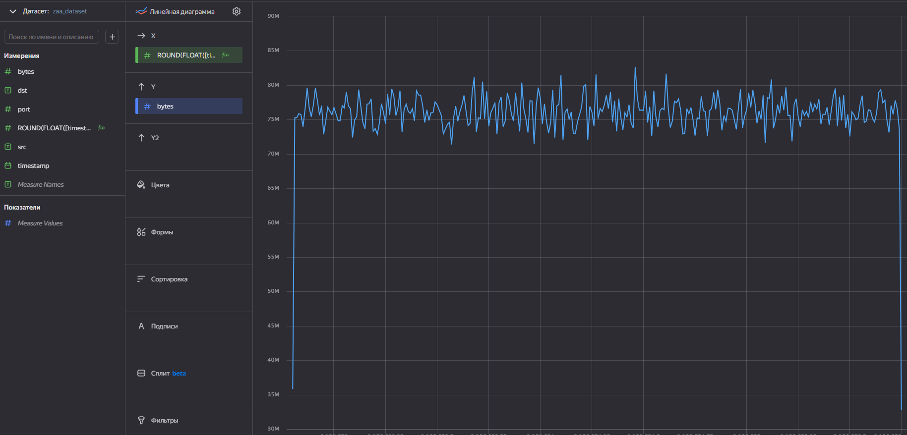
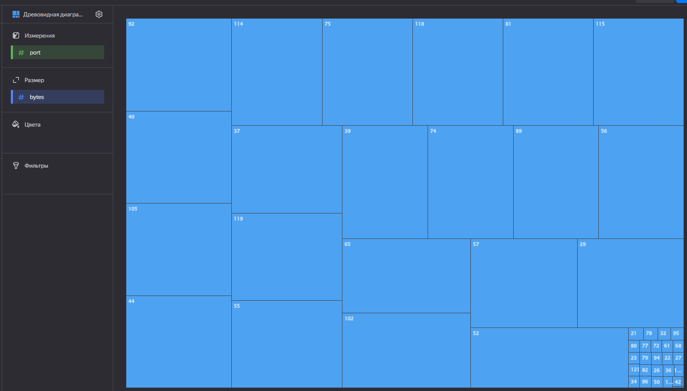
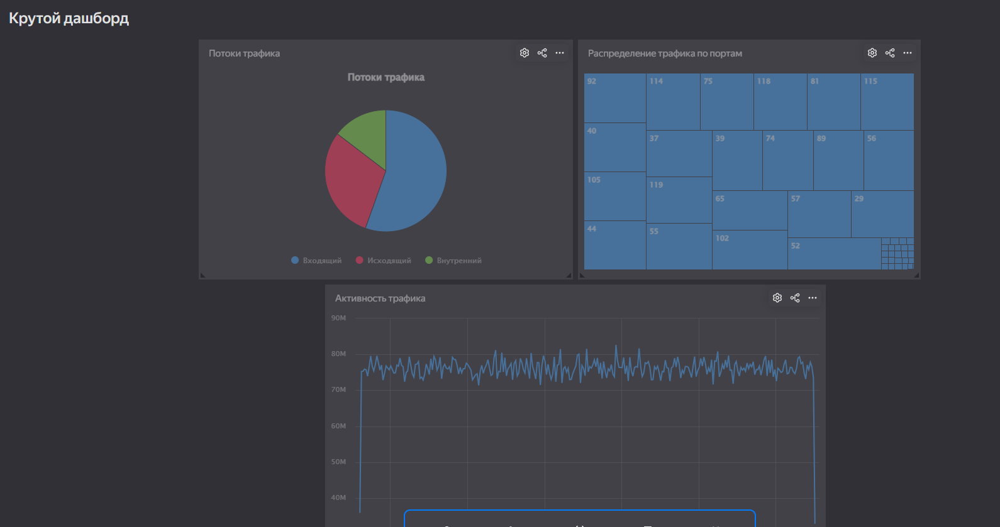

## Цель работы

1. Изучить возможности технологии Yandex DataLens для визуального анализа структурированных наборов данных
2. Получить навыки визуализации данных для последующего анализа с помощью сервисов Yandex Cloud
3. Получить навыки создания решений мониторинга/SIEM на базе облачных продуктов и открытых программных решений
4. Закрепить практические навыки использования SQL для анализа данных сетевой активности в сегментированной корпоративной сети

## Исходные данные

1.  Программное обеспечение Windows 10 Pro
2.  Rstudio Desktop
3.  Интерпретатор языка R 4.5.1
4.  Cервис Yandex DataLens

## Задание

Используя сервис Yandex DataLens настроить доступ к
Yandex Query, который Вы использовали в ходе ранее
выполненных практических работ, и визуально
представить результаты анализа данных.

### Задачи

1. Представить в виде круговой диаграммы соотношение внешнего и внутреннего сетевого трафика.
2. Представить в виде столбчатой диаграммы соотношение входящего и исходящего трафика из внутреннего сетвого сегмента.
3. Построить график активности (линейная диаграмма) объема трафика во времени.
4. Все построенные графики вывести в виде единого дашборда в Yandex DataLens.

### Шаги

#### Настроить подключение к Yandex Query из DataLens

Перйдем в соответствующий сервис – https://datalens.yandex.ru/ и выберем “Подключения” – “Создать новое подключение”

Далее выберем в разделе “Файлы и сервисы” Yandex Query, а затем настроим и проверим подключение

#### Создать из запроса YandexQuery датасет DataLens

Создадим датасет

#### Делаем нужные графики и диаграммы

Создадим чарт с круговой диаграммой демонстрирующая потоки трафика

Получившийся чарт

Создадим диаграмму демонстрирующую активность передачи трафика в течение некоторого времени

Создадим карту демонстрирующую по каким протоколам передается наибольшее количество трафика

#### Составляем дашборд

Составим дашборд из подготовленных чартов

[Ссылка на дашборд](https://datalens.ru/2lw7iutnunwmn-krutoy-dashbord)

## Вывод

В ходе выполнения работы были изучены возможности и технологии Yandex DataLens для визуального анализа структурированных наборов данных, а также получены навыки визуализации данных для последующего анализа с помощью сервисов Yandex Cloud, создания решений мониторинга/SIEM на базе облачных продуктов и открытых программных решений и использования SQL для анализа данных сетевой активности в сегментированной корпоративной сети
